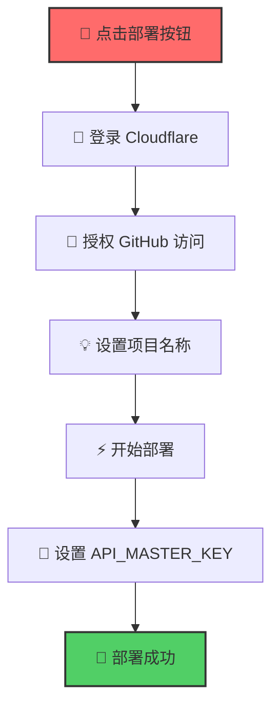
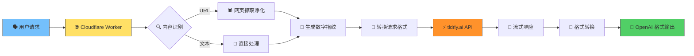
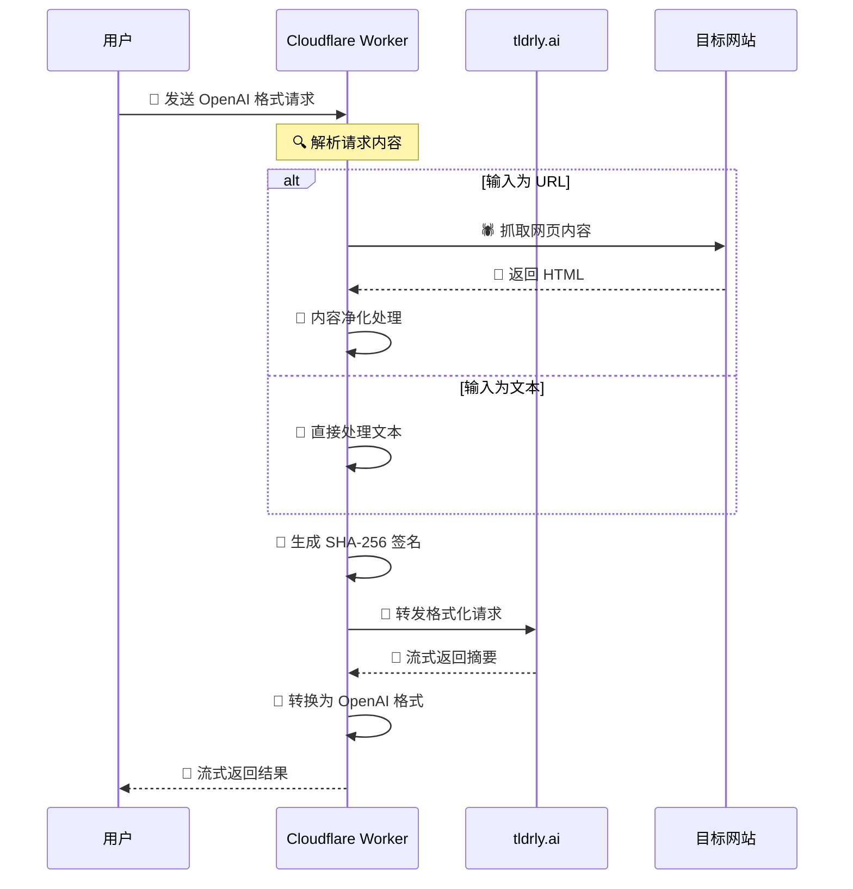
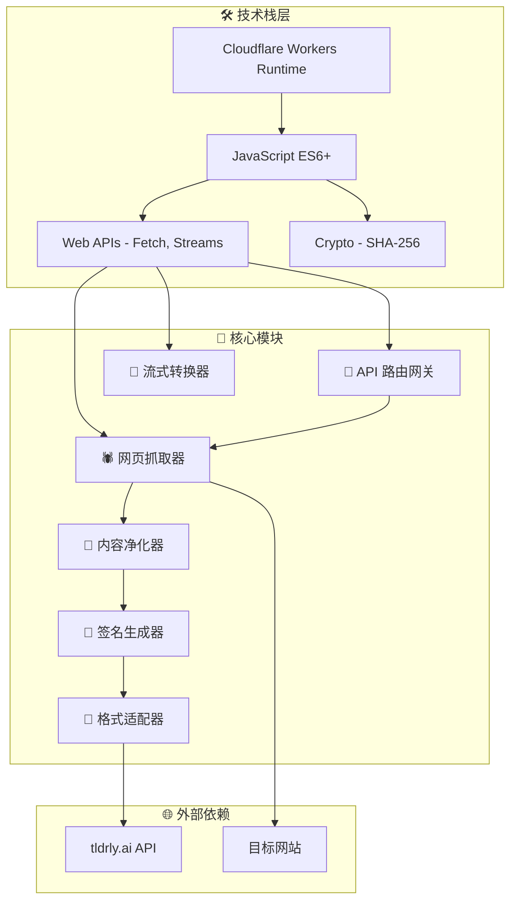
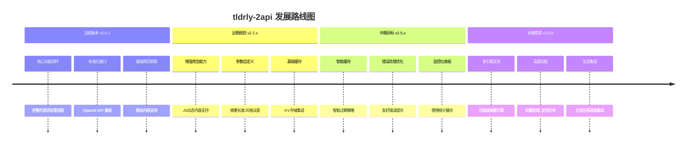

# 📑 tldrly-2api (Cloudflare Worker 单文件完美版)


[](https://workers.cloudflare.com)

**代号: Chimera Synthesis - Final Fix**

> "在信息的洪流中，我们不是要建造更高的堤坝，而是要学会优雅地冲浪。这个项目，就是你的冲浪板。" —— 首席AI执行官

`tldrly-2api` 是一个神奇的工具，它像一座桥梁，将强大的网页/文本摘要服务 [tldrly.ai](https://tldrly.ai/) 无缝转换为主流、标准化的 OpenAI API 格式。你只需要一个 Cloudflare 账户，一键部署，就能拥有一个私人、免费、高效的摘要 API 服务。

无论是冗长的技术文档、深度的新闻报道，还是一篇复杂的学术论文，只需将 URL 或文本扔给它，它就能像一位博学的智者，为你提炼出核心要点，以流式对话的方式呈现在你面前。

---

## ✨ 项目亮点与特性

*   🚀 **一键部署** - 懒人福音！只需点击一个按钮，即可将整个服务部署到你自己的 Cloudflare 账户
*   💰 **零服务器成本** - 完全利用 Cloudflare 慷慨的免费套餐，无需服务器，没有账单焦虑
*   🔌 **标准化 API** - 完美模拟 OpenAI 的 `/v1/chat/completions` 接口，无缝对接主流 AI 应用
*   🧠 **智能识别** - 自动判断输入的是 URL 还是文本，URL 自动抓取网页正文
*   🌊 **流式输出** - 摘要内容像打字机一样逐字输出，带来丝滑流畅的实时体验
*   🧹 **网页净化** - 内置强大的网页内容清洗引擎，去除广告导航等无关元素
*   🔒 **安全可靠** - 代码完全开源，部署在你自己的账户下，确保隐私安全
*   🛠️ **开发者驾驶舱** - 提供简洁的 Web UI 界面，方便快速测试和管理

---

## 🚀 懒人一键部署教程 (1分钟搞定)

准备好了吗？让我们开始一场奇妙的数字炼金术，只需点几下鼠标，就能创造出属于你自己的 AI 摘要服务！

[](https://deploy.workers.cloudflare.com/?url=https://github.com/lza6/tldrly-2api-cfwork)

### 部署流程图



### 详细步骤

1.  **点击部署按钮**
    - 点击上方 "Deploy to Cloudflare Workers" 按钮
    - 这会引导你登录或注册 Cloudflare 账户

2.  **授权并设置项目**
    - 登录后，Cloudflare 会请求授权从 GitHub 拉取代码，点击"允许"
    - 为你的项目起一个你喜欢的名字，比如 `my-tldr-api`

3.  **部署**
    - 点击"部署"按钮，稍等片刻完成部署

4.  **设置安全密钥** ⚠️ **重要！**
    - 进入 Worker 管理页面
    - 找到 `设置` → `变量` → `环境变量`
    - 点击 `添加变量`:
        - 变量名称: `API_MASTER_KEY`
        - 变量值: 设置一个**你自己知道的复杂密码**，例如 `sk-aBcDeFgHiJkLmNoPqRsT`
    - 点击 `保存并部署`

5.  **大功告成！** 🎉
    - 返回 Worker 概览页面，获取你的 API 地址
    - 格式: `https://<你的项目名>.<你的子域>.workers.dev`

---

## 📖 详细使用指南

### 系统架构概览



### 场景一：在支持 OpenAI 的客户端中使用

以 NextChat (V2) 为例：

1. 打开客户端的设置页面
2. 在 `模型提供商` 中选择 `OpenAI`
3. 将 **接口地址** 修改为你的 Worker 地址，并在末尾加上 `/v1`
   - 例如: `https://my-tldr-api.lza6.workers.dev/v1`
4. 将 **API Key** 填写为你自己设置的 `API_MASTER_KEY`
5. 在聊天界面，选择模型 `tldrly-summarizer` 或 `tldrly-auto`
6. 直接在对话框里发送网址，如 `https://www.bbc.com/news/technology-68740343`

### 场景二：通过 `curl` 直接调用

```bash
curl --location 'https://<你的项目名>.<你的子域>.workers.dev/v1/chat/completions' \
--header 'Content-Type: application/json' \
--header 'Authorization: Bearer <你的API_MASTER_KEY>' \
--data '{
    "model": "tldrly-summarizer",
    "messages": [
        {
            "role": "user",
            "content": "https://www.theverge.com/2024/3/4/24090223/apple-m3-macbook-air-review"
        }
    ],
    "stream": true
}'
```

---

## 🧠 技术原理深度解析

### 核心工作原理



### 技术栈架构



### 关键组件详解

| 组件 | 图标 | 功能描述 | 技术要点 |
|------|------|----------|----------|
| **API 路由网关** | 📡 | 处理所有入站请求，进行认证和路由分发 | JWT 验证，RESTful 路由 |
| **网页抓取器** | 🕷️ | 智能抓取网页内容，支持动态页面 | Fetch API，请求头模拟 |
| **内容净化器** | 🧹 | 去除 HTML 噪音，提取纯净文本 | 正则表达式，DOM 解析 |
| **签名生成器** | 🔐 | 生成请求签名，确保数据完整性 | SHA-256 哈希算法 |
| **流式转换器** | 🔄 | 实时转换数据流格式 | TransformStream API |
| **格式适配器** | 🎨 | 标准化输出格式 | OpenAI API 规范 |

---

## ⚙️ 核心配置说明

### 环境变量配置

```javascript
// 核心配置对象
const CONFIG = {
    API_MASTER_KEY: process.env.API_MASTER_KEY || "1", // 🔑 安全密钥
    UPSTREAM_URL: "https://0.tldrly.ai/summarize",     // ⬆️ 上游API
    ORIGIN_URL: "https://chromewebstore.google.com",   // 🎭 来源伪装
    MODELS: [                                         // 🤖 模型列表
        "tldrly-summarizer",
        "tldrly-auto"
    ],
    SCRAPER_USER_AGENT: "Mozilla/5.0..."             // 🕶️ 用户代理
};
```

### 安全配置建议

```yaml
安全最佳实践:
  ✅ 使用强密码作为 API_MASTER_KEY
  ✅ 定期轮换 API 密钥
  ✅ 限制 Worker 的访问域名
  ✅ 启用 Cloudflare 的 WAF 防护
  ❌ 不要使用默认密钥 "1"
  ❌ 不要将密钥提交到代码仓库
```

---

## 🗺️ 未来发展与路线图

### 版本演进计划



### 贡献指南

我们欢迎社区贡献！以下是主要的改进方向：

1. **🐛 Bug 修复** - 解决已知问题
2. **🚀 性能优化** - 提升响应速度
3. **🛡️ 安全增强** - 加强安全防护
4. **📚 文档完善** - 改进使用文档
5. **🌍 国际化** - 多语言支持

### 已知限制与解决方案

| 限制 | 影响 | 解决方案 |
|------|------|----------|
| 动态内容抓取 | 部分网站内容无法获取 | 集成 Puppeteer |
| 上游服务依赖 | tldrly.ai 不可用时服务中断 | 实现备用引擎 |
| 缓存机制缺失 | 重复请求消耗资源 | 集成 KV 存储 |
| 错误处理简单 | 用户体验不佳 | 细化错误分类 |

---

## 🔧 开发者资源

### 快速开始

```bash
# 克隆项目
git clone https://github.com/lza6/tldrly-2api-cfwork.git

# 安装 Wrangler CLI
npm install -g wrangler

# 登录 Cloudflare
wrangler login

# 部署到开发环境
wrangler dev
```

### API 文档

#### 获取模型列表
```http
GET /v1/models
Authorization: Bearer <your_api_key>
```

#### 创建聊天补全
```http
POST /v1/chat/completions
Authorization: Bearer <your_api_key>
Content-Type: application/json

{
    "model": "tldrly-summarizer",
    "messages": [
        {
            "role": "user",
            "content": "https://example.com/article"
        }
    ],
    "stream": true
}
```

---

## 📜 开源协议

本项目采用 **Apache License 2.0** 开源协议。

**你可以自由地：**
- ✅ 商业使用
- ✅ 修改分发  
- ✅ 专利使用
- ✅ 私人使用

**你需要：**
- 📝 保留版权声明
- 📝 声明修改内容
- 📝 包含许可副本

**你不可以：**
- ❌ 使用商标
- ❌ 追究责任
- ❌ 附加额外限制

---

## 🎯 总结

`tldrly-2api` 不仅仅是一个技术项目，它代表了一种理念：**让复杂的技术变得简单可用**。通过将专业的摘要服务封装成熟悉的 OpenAI API 格式，我们打破了技术使用的壁垒，让每个人都能享受到 AI 带来的便利。

无论你是开发者、研究者，还是普通用户，这个项目都能为你提供价值。现在就部署属于你自己的摘要服务，开启高效的信息处理之旅吧！

**在信息的海洋中，愿你能更优雅地冲浪！** 🌊

---

*最后更新: 2025年11月26日 10:52:04 | 版本: 2.0.1 | 作者: [lza6](https://github.com/lza6)*

<div align="center">

**如果这个项目对你有帮助，请给个 ⭐️ 支持一下！**

[](https://star-history.com/#lza6/tldrly-2api-cfwork&Date)

</div>
